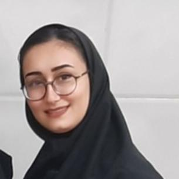

### fatemehghasemi Niyasar

### intro

+ Birthdate 1999,11,9
+ Bachelor
+ Now i am a Bachelors students in computer Engineering
+ Iran,Tehran province 

### Skill Highlights

+ network plus
+ linux 
+ java script
+ word
+ PowerPoint 
+ Excel
+ Photoshop

### Behavioral strengths

+ Communication skill
+ Accountability
+ Adaptability
+ Problem-Solving and decision-making
+ Mentoring 

### Education

+ diploma: froq andishe High School
 -2017
+ Bachelor of science: Computer Engineering 
+  -2018, Payam Noor University of Tehran

### Other Skills

+ Fluent in 2 Languages: English,persian

### Favorites

+ music 
+ swim
+ book riding 

### Working Experience

+ Now i am a Bachelors students in computer Engineering 

### Social Media

+ https://facebook.com/FatemehGhasemi 
+ https://Instagram.com/miss.f7420
+ fatemehghasemi78780@gmail.com 
 

[رزومه فارسی](/resume-fa)
 
<a href="http://s16.picofile.com/file/8412117484/%D8%B1%D8%B2%D9%88%D9%85%D9%87_%D9%81%D8%A7%D8%B7%D9%85%D9%87_%D9%82%D8%A7%D8%B3%D9%85%DB%8C_%D9%86%DB%8C%D8%A7%D8%B3%D8%B1.pdf.html">Download resume</a>
